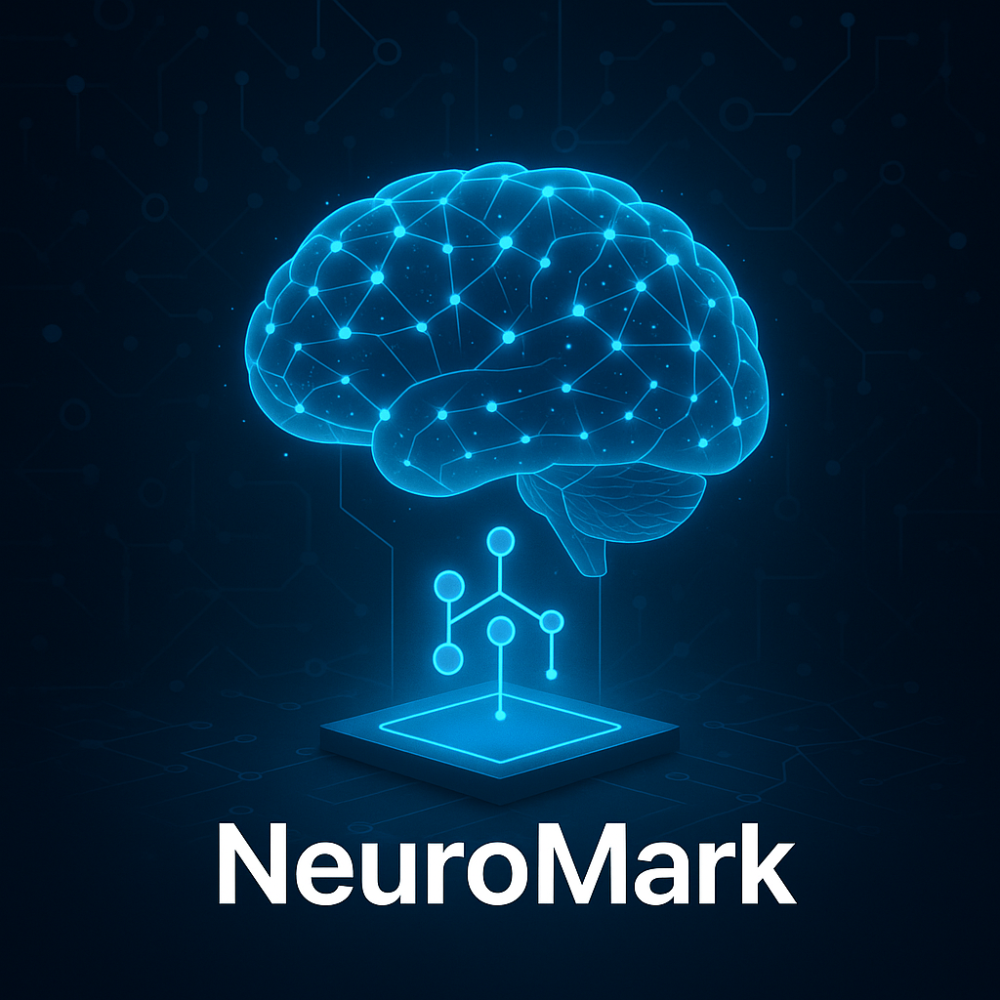
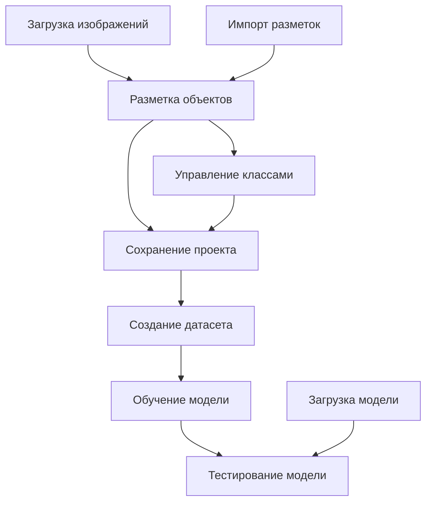

# NeuroMark - Приложение для обучения нейросетей на размеченных изображениях



NeuroMark - это приложение с графическим интерфейсом для разметки изображений, создания датасетов, обучения и тестирования моделей нейронных сетей для задач обнаружения объектов.

## 🤖 Что такое нейросеть и как она работает?

**Нейронная сеть** - это математическая модель, вдохновленная работой человеческого мозга. Она состоит из множества взаимосвязанных "нейронов" (узлов), которые обрабатывают информацию и учатся на примерах.

### Как работает обучение нейросети:

1. **Входные данные** - изображения с разметкой объектов
2. **Обработка** - нейросеть анализирует пиксели и ищет паттерны
3. **Предсказание** - сеть пытается найти объекты на изображении
4. **Сравнение** - результат сравнивается с правильной разметкой
5. **Корректировка** - веса нейронов изменяются для улучшения точности
6. **Повторение** - процесс повторяется тысячи раз

### 🎯 Что умеет NeuroMark:

- **Разметка изображений** - рисуйте прямоугольники вокруг объектов
- **Создание датасетов** - автоматическая подготовка данных для обучения
- **Обучение моделей** - тренировка нейросети на ваших данных
- **Тестирование** - проверка точности обученной модели
- **Импорт разметок** - поддержка форматов YOLO, COCO, JSON

## ⚙️ Настройки приложения

### Основные параметры обучения:

- **Эпохи (Epochs)** - количество полных проходов по датасету (рекомендуется 50-200)
- **Размер батча (Batch Size)** - количество изображений за один проход (4-32)
- **Скорость обучения (Learning Rate)** - шаг изменения весов (0.001-0.0001)
- **Размер изображения** - входное разрешение для сети (416x416, 640x640)

### Параметры модели:

- **Архитектура** - YOLOv5, YOLOv8, или кастомная
- **Размер модели** - nano, small, medium, large (баланс скорости и точности)
- **Предобучение** - использование весов с ImageNet для ускорения обучения

### Настройки разметки:

- **Классы объектов** - названия и цвета для разных типов объектов
- **Форматы экспорта** - YOLO, COCO, JSON для совместимости
- **Валидация** - процент данных для проверки (обычно 20%)

## 1. Структура проекта

```
NeuroMark/
├── NeuroMark.py     # Основной файл приложения
└── NeuroMark.png    # Иконка приложения
```

При работе с приложением создаются дополнительные директории:
```
NeuroMark/
├── <project_name>/      # Директория проекта
│   ├── images/          # Изображения проекта
│   ├── annotations/     # Аннотации (разметки) изображений
│   ├── datasets/        # Созданные датасеты для обучения
│   │   └── dataset_<format>_<timestamp>/
│   │       ├── train/   # Обучающая выборка
│   │       │   ├── images/
│   │       │   └── labels/
│   │       ├── val/     # Валидационная выборка
│   │       │   ├── images/
│   │       │   └── labels/
│   │       ├── classes.txt  # Файл с классами объектов
│   │       └── README.md    # Информация о датасете
│   ├── models/          # Обученные модели
│   └── project.json     # Файл с информацией о проекте
```

## 2. Описание файлов

### NeuroMark.py

**Назначение**: Основной файл приложения, содержащий весь код для работы с изображениями, разметкой, обучением и тестированием моделей.

**Ключевые классы**:

1. **ImageAnnotation** - Класс для работы с аннотациями изображений
   - Хранит информацию о разметке изображения (боксы, классы)
   - Поддерживает импорт/экспорт в форматы YOLO, COCO и JSON

2. **ObjectDetectionDataset** - Класс для работы с датасетами (наследник torch.utils.data.Dataset)
   - Загружает изображения и разметки для обучения моделей
   - Преобразует данные в формат, подходящий для PyTorch

3. **ModelDownloader** - Класс для загрузки предобученных моделей
   - Поддерживает загрузку моделей из интернета
   - Сохраняет модели в формате PyTorch

4. **ClassManager** - Диалог для управления классами объектов
   - Позволяет добавлять, редактировать и удалять классы
   - Настраивать цвета для визуализации классов

5. **SimpleObjectDetector** - Нейронная сеть для обнаружения объектов
   - Использует MobileNetV2 в качестве основы
   - Добавляет слои для предсказания боксов и классов

6. **TrainingThread** - Поток для обучения модели
   - Выполняет обучение в отдельном потоке
   - Отправляет сигналы о прогрессе и логах

7. **ImageWidget** - Виджет для отображения и разметки изображений
   - Позволяет рисовать, редактировать и удалять боксы
   - Визуализирует разметку с учетом классов

8. **MainWindow** - Главное окно приложения
   - Содержит все элементы интерфейса
   - Управляет логикой работы приложения

9. **ImportDialog** - Диалог для импорта разметок
   - Поддерживает импорт разметок в форматах YOLO, COCO и JSON

**Связи между классами**:
- `MainWindow` использует `ImageWidget` для отображения и разметки изображений
- `MainWindow` создает и хранит объекты `ImageAnnotation` для каждого изображения
- `MainWindow` запускает `TrainingThread` для обучения моделей
- `MainWindow` использует `ModelDownloader` для загрузки предобученных моделей
- `MainWindow` открывает `ClassManager` для управления классами
- `MainWindow` открывает `ImportDialog` для импорта разметок
- `TrainingThread` использует `ObjectDetectionDataset` для загрузки данных
- `TrainingThread` создает и обучает `SimpleObjectDetector`

**Логика работы**:
1. Пользователь создает или загружает проект
2. Загружает изображения и размечает объекты
3. Управляет классами объектов
4. Создает датасет из размеченных изображений
5. Выбирает модель и настраивает параметры обучения
6. Запускает обучение модели
7. Тестирует обученную модель на новых изображениях

### NeuroMark.png

**Назначение**: Иконка приложения, отображается в заголовке окна и на панели задач.

## 3. Архитектура проекта

### Общая структура

NeuroMark построен на основе архитектуры Model-View-Controller (MVC):
- **Model**: Классы `ImageAnnotation`, `ObjectDetectionDataset`, `SimpleObjectDetector`
- **View**: Классы `ImageWidget`, `MainWindow`, `ClassManager`, `ImportDialog`
- **Controller**: Методы в классе `MainWindow`, управляющие взаимодействием между моделью и представлением

### Потоки данных



## 4. Библиотеки/фреймворки

### PyQt6
**Назначение**: Создание графического интерфейса пользователя
**Где используется**:
- Все классы интерфейса (`MainWindow`, `ImageWidget`, `ClassManager`, `ImportDialog`)
- Сигналы и слоты для обмена данными между компонентами
- Отрисовка разметки и визуализация данных

### PyTorch
**Назначение**: Создание и обучение нейронных сетей
**Где используется**:
- Класс `SimpleObjectDetector` для создания модели
- Класс `TrainingThread` для обучения модели
- Класс `ObjectDetectionDataset` для подготовки данных
- Загрузка и сохранение моделей

### OpenCV (cv2)
**Назначение**: Обработка изображений
**Где используется**:
- Чтение изображений для предсказания в методе `run_prediction`
- Получение размеров изображений

### PIL (Pillow)
**Назначение**: Работа с изображениями
**Где используется**:
- Загрузка изображений в класс `ImageAnnotation`
- Преобразование изображений в классе `ObjectDetectionDataset`
- Загрузка тестовых изображений для предсказания

### NumPy
**Назначение**: Работа с многомерными массивами
**Где используется**:
- Обработка результатов предсказания модели
- Преобразование данных между PyTorch и Python

### Matplotlib
**Назначение**: Визуализация данных
**Где используется**:
- Потенциально может использоваться для визуализации результатов обучения (в текущей версии не используется активно)

### Requests
**Назначение**: HTTP-запросы
**Где используется**:
- Класс `ModelDownloader` для загрузки предобученных моделей из интернета

### tqdm
**Назначение**: Отображение прогресса выполнения операций
**Где используется**:
- Потенциально может использоваться для отображения прогресса длительных операций (в текущей версии не используется активно)

## 5. Точка входа и запуск

### Как запускается проект

Проект запускается через выполнение файла `NeuroMark.py`:

```bash
python NeuroMark.py
```

### Что выполняется первым

1. Импортируются необходимые библиотеки
2. Определяются все классы приложения
3. В блоке `if __name__ == "__main__":` создается экземпляр приложения QApplication
4. Создается и отображается главное окно приложения (`MainWindow`)
5. Запускается цикл обработки событий приложения

```python
if __name__ == "__main__":
    app = QApplication(sys.argv)
    window = MainWindow()
    window.show()
    sys.exit(app.exec())
```

## 6. Архитектурные особенности

### Нестандартные решения

1. **Универсальный класс аннотаций**: Класс `ImageAnnotation` поддерживает работу с разными форматами разметки (YOLO, COCO, JSON), что позволяет легко конвертировать данные между форматами.

2. **Отдельный поток для обучения**: Обучение модели выполняется в отдельном потоке (`TrainingThread`), что позволяет не блокировать интерфейс пользователя во время длительного процесса обучения.

3. **Интерактивная разметка**: Класс `ImageWidget` реализует интерактивную разметку изображений с возможностью создания, редактирования и удаления боксов с помощью мыши.

4. **Загрузка предобученных моделей**: Класс `ModelDownloader` позволяет загружать предобученные модели из интернета, что упрощает начало работы с приложением.

### Причины выбора архитектуры

1. **PyQt6 для интерфейса**: Выбран за его кроссплатформенность, богатый набор виджетов и хорошую интеграцию с Python. Это позволяет создать удобный и отзывчивый интерфейс пользователя.

2. **PyTorch для машинного обучения**: Выбран за его гибкость, удобство использования и широкие возможности для создания и обучения нейронных сетей. PyTorch хорошо интегрируется с Python и имеет активное сообщество.

3. **Модульная структура**: Приложение разделено на логические модули (классы), что упрощает разработку, тестирование и поддержку кода. Каждый класс отвечает за свою часть функциональности.

4. **Многопоточность**: Использование отдельного потока для обучения позволяет сохранить отзывчивость интерфейса во время длительных операций.

5. **Поддержка различных форматов**: Поддержка форматов YOLO, COCO и JSON позволяет интегрировать приложение с другими инструментами для работы с данными и моделями.

---

## 🌟 Поддержите проект!

Если NeuroMark помог вам в работе с нейросетями, поддержите проект:

### ⭐ Поставьте звезду на GitHub
[](https://github.com/Legenda658/NeuroMark)

### 👨‍💻 Подпишитесь на автора
- **GitHub**: [@Legenda658](https://github.com/Legenda658)
- **Telegram**: [@FitoDomik](https://t.me/FitoDomik)
- **Сайт**: [fitodomik.ru](https://fitodomik.ru)

### 💡 Почему важна ваша поддержка?
- **Мотивация** - звезды показывают, что проект полезен
- **Развитие** - обратная связь помогает улучшать функционал
- **Сообщество** - больше пользователей = больше идей
- **Открытый код** - каждый может внести свой вклад

## Заключение

NeuroMark представляет собой комплексное решение для разметки изображений, создания датасетов, обучения и тестирования моделей нейронных сетей для задач обнаружения объектов. Приложение имеет удобный графический интерфейс и поддерживает все этапы работы с данными и моделями.

Благодаря модульной архитектуре и использованию современных библиотек, приложение легко расширять и адаптировать под конкретные задачи. 
